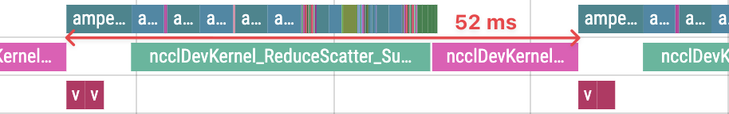
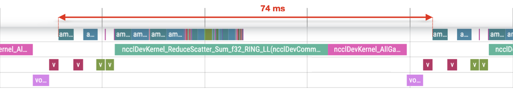

# YaFSDP

- [Overview](#overview)
- [Advantages over FSDP](#advantages-over-fsdp)
- [Examples](#examples)
- [Issues and questions](#issues-and-questions)
- [Citation](#citation)

## Overview

YaFSDP is a Sharded Data Parallelism framework, designed to work well with transformer-like
neural network architectures.

You can find more info on YaFSDP internals in our [medium blog post]().

## Advantages over FSDP

YaFSDP is up to 20% faster for pre-training LLMs and performs better in high
memory pressure conditions. It is designed to reduce communications and memory operations overhead.

YaFSDP:



FSDP:



### Benchmarks

We've compared YaFSDP with FSDP on a variety of pre-training setups ranging from:

- 7B to 70B parameters
- 64 to 256 devices
- 2048 to 8192 tokens per sequence

In each run per device batch size is set to 1.

| model       | gpu-count | seq-len | num-ckpt-layers | speedup |
| :---------- | --------: | ------: | --------------: | ------: |
| Llama-2-7b  |        64 |    2048 |               0 |   9.92% |
| Llama-2-7b  |        64 |    4096 |               0 |   3.43% |
| Llama-2-7b  |        64 |    8192 |               0 |   2.68% |
| Llama-2-7b  |       128 |    2048 |               0 |   9.57% |
| Llama-2-7b  |       128 |    4096 |               0 |   2.42% |
| Llama-2-7b  |       128 |    8192 |               0 |   2.32% |
| Llama-2-13b |       128 |    2048 |               0 |  12.10% |
| Llama-2-13b |       128 |    4096 |               0 |   3.49% |
| Llama-2-34b |       128 |    2048 |               0 |  20.70% |
| Llama-2-34b |       256 |    2048 |               0 |  21.99% |
| Llama-2-34b |       256 |    4096 |               5 |   8.35% |
| Llama-2-70b |       256 |    2048 |              10 |  21.48% |
| Llama-2-70b |       256 |    4096 |              50 |   7.17% |
| Llama-3-8B  |        64 |    2048 |               0 |  10.15% |
| Llama-3-8B  |        64 |    4096 |               0 |   7.98% |
| Llama-3-70B |       256 |    2048 |              20 |  26.60% |

## Examples

To try out YaFSDP you should:

1. build the docker container with `docker/build.sh`
2. launch one of the examples in the `examples` folder.

## Issues and questions

If you encounter any bugs of have any questions feel free to open a GitHub issue.

## Citation

If you use this codebase, please cite it by using the following BibTeX entry:

```bibtex
@misc{YaFSDP2024,
  author =       {Mikhail Khrushchev and Anton Frolov and Ruslan Vasilev},
  title =        {YaFSDP: Yet another Fully Sharded Data Parallel},
  howpublished = {\url{https://github.com/yandex/YaFSDP}},
  year =         {2024}
}
```
